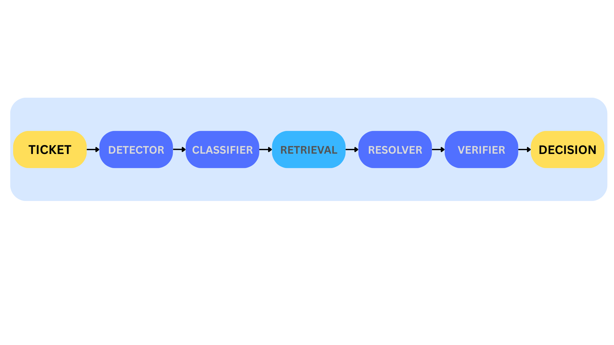

# Agentic IT Support Ticket Router

## Problem

Customer support teams are overwhelmed with tickets that could be automatically resolved or properly routed, leading to slow response times and poor customer satisfaction.

Without automation:
- urgent issues are lost 
- humans route tickets manually
- simple tickets take up expensive support time
- unsafe automation risks customer satisfaction

## Objective

Build an AI agent that analyzes incoming support tickets, extracts key information, checks knowledge bases, and either resolves the ticket automatically or routes it to the appropriate specialist with context.

### Decision

- **AUTO_RESOLVE**: automatically generate a grounded response

- **ESCALATE**: route to a human specialist

- **ASK_CLARIFYING**: ask for more/missing information from the user

## Components

**Ticket Classification**: Use LangChain to classify tickets by urgency, department, and complexity (_IN PROGRESS_ - Currently NOT Using LangChain)

**Knowledge Base RAG**: Vector store with company documentation, FAQs, and past ticket resolutions (_IN PROGRESS_ - Currently using baseline, NOT vector store)

**LangGraph Workflow**: Multi-step decision tree that attempts self-resolution before escalation (_COMPLETE_)

**Integration Points**: Email/Zendesk/Slack APIs for ticket ingestion (_PLANNED_)

**Human-in-the-Loop**: Escalation mechanism with confidence scoring (_COMPLETE_)


## Tech Stack

* Python
* LangChain
* LangGraph
* ChromaDB/Pinecone
* FastAPI
* React dashboard


## Dataset

Customer support dataset:

```
data/tickets/customer_support_tickets.csv
```

Used solely as input simulation

## System Architecture



### Pipeline

- **Ticket**: Normalized structured representation of a support ticket
- **Detector**: Early safety & completeness analysis
- **Classifier**: Operational triage of the ticket based on department, urgency, complexity
- **RAG Retrieval**: Extracts relevant support knowledge and outputs citations
- **Resolver**: Curates a response (response text, citation references, confidence score) grounded in retrieved evidence 
- **Verifier**: Checks security risk, evidence grounding, confidence threshold
- **Decision**: Final action of either _AUTO RESOLVE_ , _ASK CLARIFYING_ , _ESCALATE_

## Project Structure
```
.
├── README.md
├── agents
│   ├── __init__.py
│   ├── agenticClassifier.py
│   ├── agenticDetector.py
│   ├── agenticResolver.py
│   ├── agenticRouter.py
│   └── agenticVerifier.py
├── apps
├── data
│   ├── KB
│   ├── __init__.py
│   ├── load_raw_csv.py
│   └── tickets
│       ├── customer_support_tickets.csv
│       └── tickets_private.csv
├── docs
├── images
│   └── ITSupportSystemsArchitecture.png
├── main.py
├── outputs
│   ├── chroma_db
│   │   └── chroma.sqlite3
│   └── runs
│       ├── replay_20260128_001329.jsonl
│       ├── ...
├── rag
│   ├── __init__.py
│   ├── chunking.py
│   ├── embeddings.py
│   ├── indexKB.py
│   ├── indexTickets.py
│   ├── loadKB.py
│   ├── prompts.py
│   ├── retrieve.py
│   ├── utils.py
│   └── vectorDB.py
├── schemas
│   ├── __init__.py
│   ├── decision.py
│   ├── detector.py
│   ├── evidence.py
│   ├── resolution.py
│   ├── ticket.py
│   ├── triage.py
│   └── verifier.py
├── scripts
│   ├── eval_run.py
│   ├── replay.py
│   └── seedKB.py
└── tests
```

## How To Run

Replay ticket:

```
python scripts/replay.py --n 10
```

Human-In-The-Loop workflow:

```
python main.py
```

## References

- Aniket Hingane. “Building an Intelligent Customer Support System with Multi-Agent Architecture.” DEV Community, 28 Dec. 2025, dev.to/exploredataaiml/building-an-intelligent-customer-support-system-with-multi-agent-architecture-236h. 

- https://www.kaggle.com/datasets/suraj520/customer-support-ticket-dataset