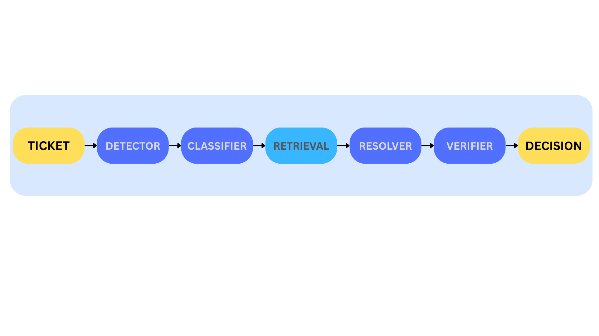

# Agentic IT Support Ticket Router

[](https://www.python.org/)
[](LICENSE)

An intelligent AI-powered system for automating customer support ticket routing and resolution using multi-agent architecture and retrieval-augmented generation (RAG).

## Table of Contents

- [Problem](#problem)
- [Objective](#objective)
- [Key Features](#key-features)
- [Tech Stack](#tech-stack)
- [System Architecture](#system-architecture)
- [Pipeline Overview](#pipeline-overview)
- [Installation](#installation)
- [Usage](#usage)
- [Dataset](#dataset)
- [Metrics](#metrics)
- [Project Structure](#project-structure)
- [Future Enhancements](#future-enhancements)
- [References](#references)


## Problem

Customer support teams are overwhelmed with tickets that could be automatically resolved or properly routed, leading to slow response times and poor customer satisfaction.

Without automation:
- Urgent issues are lost in the queue
- Humans manually route tickets, wasting time
- Simple tickets consume expensive support resources
- Unsafe automation risks damaging customer satisfaction

## Objective

Build an AI agent that analyzes incoming support tickets, extracts key information, checks knowledge bases, and either resolves the ticket automatically or routes it to the appropriate specialist with context.

This system is designed as a **decision engine** rather than a chatbot. Agents *analyze* the ticket, *propose* an action, and a verifier *enforces* safety rules before automation is allowed. Automation only occurs when confidence and grounding conditions are satisfied—otherwise, the ticket escalates to a human specialist.

### Decision Types

- **AUTO_RESOLVE**: Automatically generate a grounded response
- **ESCALATE**: Route to a human specialist
- **ASK_CLARIFYING**: Request more/missing information from the user

## Key Features

- **Multi-Agent Architecture**: Specialized agents for detection, classification, routing, resolution, and verification
- **Safety-First Design**: Built-in verification to prevent unsafe automation
- **Retrieval-Augmented Generation (RAG)**: Grounded responses using knowledge base retrieval
- **Human-in-the-Loop**: Escalation and clarification mechanisms for complex cases
- **Modular Pipeline**: Easily extensible with new agents or integrations

## Tech Stack

- **Python** 3.8+
- **LangChain** & **LangGraph** for agent orchestration
- **ChromaDB** / **Pinecone** for vector storage
- **FastAPI** for API endpoints
- **Pydantic** for data validation
- **Docker** for containerization


## Dataset

Customer support dataset used for simulation and testing:

```
data/tickets/customer_support_tickets.csv
```

**Note**: This dataset is used solely for input simulation, replay, and testing. It is **not** intended as an actual production support dataset.

## System Architecture



## Pipeline Overview

The system processes tickets through a sequential pipeline:

1. **Ticket Normalization**: Standardizes incoming ticket data
2. **Detector**: Performs early safety and completeness checks
3. **Classifier**: Triages tickets by department, urgency, and complexity
4. **RAG Retrieval**: Retrieves relevant knowledge base evidence
5. **Resolver**: Generates a grounded response draft
6. **Verifier**: Validates safety and grounding before automation
7. **Decision**: Final action (auto-resolve, escalate, or clarify)

LangGraph orchestrates this as a state machine, allowing branching based on risk and confidence levels, with human approval when needed.

## Installation

1. **Clone the repository**:
   ```bash
   git clone https://github.com/yourusername/agentic-it-support-ticket-router.git
   cd agentic-it-support-ticket-router
   ```

2. **Install dependencies**:
   ```bash
   pip install -r requirements.txt
   ```

3. **(Optional) Set up vector database**:
   - For ChromaDB: No additional setup required
   - For Pinecone: Configure API keys and connection

## Usage

### Replay Tickets (Batch Processing)
Run the system on sample tickets:
```bash
python scripts/replay.py --n 10
```

### Interactive Workflow (Human-in-the-Loop)
Start the main workflow:
```bash
python main.py
```

### API Server
Launch the FastAPI server:
```bash
uvicorn apps.api:app --reload --host 0.0.0.0 --port 8000
```
Access the API docs at `http://localhost:8000/docs`.

## Future Enhancements

- Integrate LangChain for advanced ticket classification
- Implement full RAG with vector-based knowledge retrieval
- Add ticket ingestion from Email, Slack, and Zendesk APIs
- Develop a React dashboard for monitoring and management

## Project Structure
```
.
├── agents
│   ├── __init__.py
│   ├── agenticClassifier.py
│   ├── agenticDetector.py
│   ├── agenticResolver.py
│   ├── agenticRouter.py
│   ├── agenticVerifier.py
│   └── agentsArchitectureDetails.md
├── apps
│   ├── api.py
│   └── service.py
├── data
│   ├── __init__.py
│   ├── KB
│   │   ├── company_documentation.md
│   │   ├── faqs.md
│   │   └── past_ticket_resolutions.md
│   ├── load_raw_csv.py
│   └── tickets
│       ├── customer_support_tickets.csv
│       └── tickets_private.csv
├── Dockerfile
├── docs
├── graph
│   ├── __init__.py
│   ├── nodes.py
│   ├── state.py
│   └── workflow.py
├── images
│   └── ITSupportSystemsArchitecture.png
├── main.py
├── outputs
│   ├── chroma_db
│   │   └── chroma.sqlite3
│   └── runs
│       ├── ...
├── rag
│   ├── __init__.py
│   ├── chunking.py
│   ├── embeddings.py
│   ├── indexKB.py
│   ├── indexTickets.py
│   ├── loadKB.py
│   ├── prompts.py
│   ├── RAGArchitectureDetails.md
│   ├── retrieve.py
│   ├── utils.py
│   └── vectorDB.py
├── README.md
├── requirements.txt
├── schemas
│   ├── __init__.py
│   ├── decision.py
│   ├── detector.py
│   ├── evidence.py
│   ├── resolution.py
│   ├── SchemasArchitectureDetails.md
│   ├── ticket.py
│   ├── triage.py
│   └── verifier.py
├── scripts
│   ├── eval_run.py
│   ├── metrics.py
│   ├── replay.py
│   └── seedKB.py
└── tests
```

## References

- [Building an Intelligent Customer Support System with Multi-Agent Architecture](https://dev.to/exploredataaiml/building-an-intelligent-customer-support-system-with-multi-agent-architecture-236h) by Aniket Hingane
- [Customer Support Ticket Dataset](https://www.kaggle.com/datasets/suraj520/customer-support-ticket-dataset) on Kaggle